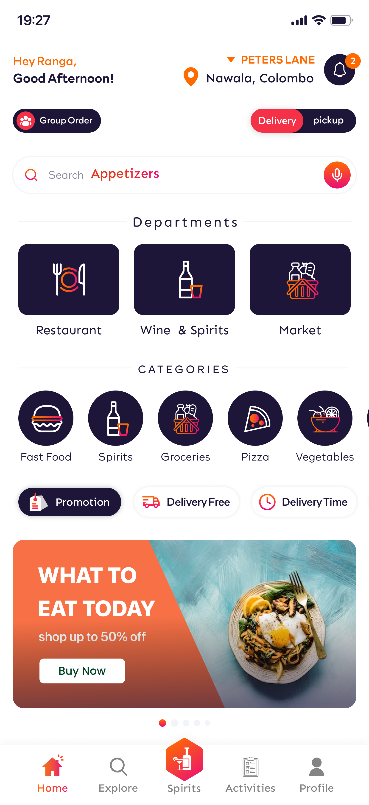

# 📱 Multi-Service Delivery Platform UI/UX Case Study

This project is a comprehensive multi-service platform for food, grocery, and liquor delivery, designed to provide a seamless, user-friendly ordering experience.

---

### 🔍 Project Overview
- **Goal:** Create an intuitive ordering experience for food, groceries, and liquor categories.
- **Role:** Senior UI/UX Designer.
- **Design Process:** Research, Persona Development, Wireframing, Prototyping, and Usability Testing.

### 🎨 Key Features
*   **Unified Ordering System:** Easy navigation between different delivery categories.
*   **Seamless Checkout:** Optimized flow to reduce cart abandonment.
*   **Real-time Tracking:** Clean visual representation of delivery status.

---

### 📸 UI Design Highlights

| Home | After Adding Items | My Cart |
| :---: | :---: | :---: |
|  |  |  |

| Search Results | Shop (Delivery/Pickup) | Restaurant Dash |
| :---: | :---: | :---: |
|  |  |  |

| Tracking (Rider Assigned) |
| :---: |
|  |

---

### 🔗 Project Access
*Note: Due to confidentiality, the live prototype link is currently restricted. Please contact me if you would like to discuss this project further.*
